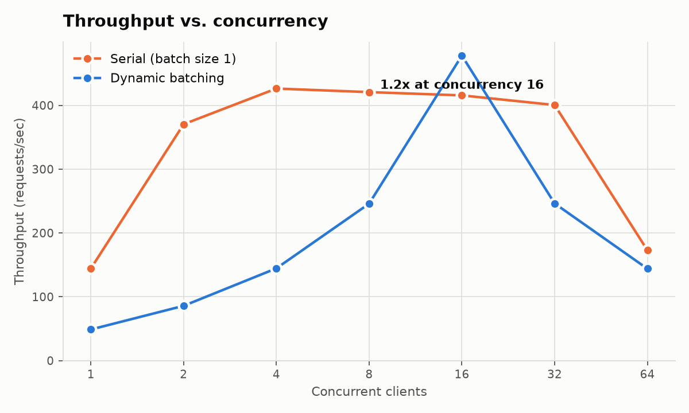

# CUDA Inference Server

A GPU inference server that batches concurrent requests on the fly. A C++
scheduler collects incoming requests into a batch — closing it when either a
size threshold or a time window is hit, whichever comes first — and runs the
batch through ResNet-50 on ONNX Runtime's CUDA execution provider. A FastAPI
frontend accepts requests asynchronously and calls into the C++ layer through
pybind11 without blocking the event loop.

Serving requests one at a time wastes a GPU: each inference occupies the device
briefly and leaves it idle between calls. Batching amortizes that, but only if
the batcher itself is not slower than the thing it replaces — which, as the
benchmark below shows, is not automatic.

## Result

Measured on an RTX A4000 against the same server configured to serve one
request at a time. Full methodology and raw data: [docs/benchmarks.md](docs/benchmarks.md).



| @ concurrency 16 | serial (batch 1) | dynamic batching | change |
|---|---|---|---|
| throughput | 416 req/s | **478 req/s** | **1.15x** |
| p50 latency | 35.3 ms | **28.0 ms** | 21% lower |
| p99 latency | **51.0 ms** | 54.9 ms | 8% higher |
| mean batch size | 1.0 | 7.0 | — |

More throughput and a lower median, paid for in the tail — the batching tradeoff
in its expected form. Below concurrency 16 batching loses (partly-filled batches
still cost a full one), and above it neither mode is measuring the batcher: the
Python frontend saturates near 470 req/s and serial degrades there too.

## The interesting part: it was 5x *slower* first

The first working end-to-end measurement had dynamic batching running about five
times slower than no batching at all. Finding out why took three wrong
hypotheses and one useful habit — isolating the layer under suspicion instead of
reasoning about it.

Timing the engine alone ([`cpp/tools/bench_engine.cpp`](cpp/tools/bench_engine.cpp),
no scheduler, no HTTP, no Python) showed batching *did* pay — 2.31 ms/request at
batch 1 versus 1.36 ms at batch 8. But feeding it the batch sizes a scheduler
actually produces collapsed it, and a sweep over how many distinct shapes the
session sees found the cause:

| shapes in use | median call | throughput |
|---|---|---|
| 4 (batches padded to 1/2/4/8) | 76.1 ms | 75 req/s |
| 2 (padded to 4/8) | 77.3 ms | 91 req/s |
| **1 (all padded to 8)** | **12.2 ms** | **372 req/s** |

Two shapes cost the same as four. ONNX Runtime keeps a compiled plan for only
the most recent input shape, so *any* variation pays a full re-plan — meaning
bucketing to a small set does nothing and only a single fixed shape works. The
fix is to pad every batch up to `max_batch_size` and discard the padded output
rows. Server-side execution time then drops to a flat 10.9 ms at every
concurrency level, matching the standalone measurement exactly.

Two earlier hypotheses were wrong, and the measurements that killed them are
written down in [docs/benchmarks.md](docs/benchmarks.md) alongside the one that
was right.

## Architecture

```
HTTP request
  │
  ▼
FastAPI  ──► thread-pool executor ──► pybind11 binding (releases the GIL)
  │                                          │
  │                                          ▼
  │                                   RequestQueue          (C++, mutex + condvar)
  │                                          │
  │                                   Scheduler worker      (one thread)
  │                                          │  drains on size OR timeout
  │                                          ▼
  │                                   ExecutionEngine       (ONNX Runtime, CUDA EP)
  │                                          │  batch padded to one fixed shape
  ◄──────────────── future resolves ─────────┘
```

Detail on each layer, and the reasoning behind the design decisions:
[docs/architecture.md](docs/architecture.md).

## Layout

| path | what |
|---|---|
| `cpp/src/scheduler/` | request queue and batching scheduler |
| `cpp/src/engine/` | ONNX Runtime engine, CUDA engine, CPU stub |
| `cpp/src/kernels/` | hand-written CUDA kernels and stream pool |
| `cpp/src/memory/` | RAII device/pinned buffers, pooled allocator |
| `cpp/src/bindings/` | pybind11 module (the only file that includes pybind11) |
| `python/cuda_db/` | FastAPI app, config, preprocessing |
| `benchmarks/` | load-test harness and plotting |
| `cpp/tools/` | standalone engine benchmark used for the diagnosis above |

## Build and run

The C++ core builds and its tests pass with no GPU, using a stub engine — that
is what keeps the scheduler developable on a laptop:

```bash
./scripts/build.sh cpp        # C++ core + GoogleTest suite
./scripts/build.sh python     # editable install, stub engine
```

On a CUDA machine with [ONNX Runtime GPU](https://github.com/microsoft/onnxruntime/releases)
extracted and `ONNXRUNTIME_ROOT` pointing at it:

```bash
python models/export_resnet.py            # writes models/resnet50.onnx
./scripts/build.sh gpu-python             # editable install with CUDA + ONNX

CUDA_DB_MODEL_PATH=models/resnet50.onnx \
  python -m uvicorn cuda_db.server.app:app --port 8000
```

`GET /healthz` reports which engine is live plus batching counters — worth
checking, since the stub returns plausibly-shaped output and is otherwise
indistinguishable from the real model.

Reproduce the benchmark:

```bash
CUDA_DB_MODEL_PATH=models/resnet50.onnx python benchmarks/load_test.py \
    --mode both --concurrency 1,2,4,8,16,32,64 --num-requests 300 --warmup 50
```

## Testing

```bash
./scripts/build.sh cpp                    # 17 tests, no GPU required
python -m pytest tests/integration -q     # FastAPI end-to-end
```

The C++ suite covers the queue's dual-trigger and shutdown-drain behaviour under
concurrent producers (verified clean under ThreadSanitizer), the scheduler's
batch-row-to-request mapping, CUDA memory pooling, and kernel correctness. GPU
and model-dependent tests skip themselves when neither is present, so the suite
stays green on a laptop.
